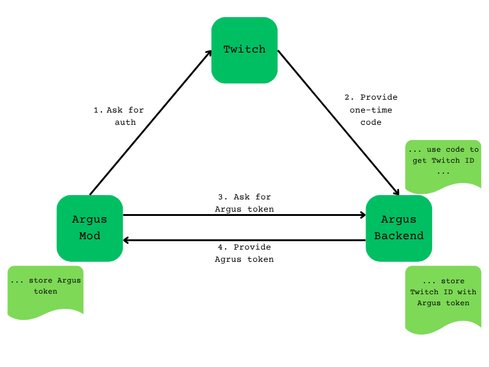

# How Argus Works

If you wish to dive deeper into how Argus works, you might want to look at two other relevant repositories:

- [Argus Backend](https://github.com/bmilojkovic/argus-h2-backend)
- [Argus Twitch Extension](https://github.com/bmilojkovic/argus-h2-twitch)

The main flow of data from the game to Twitch is as follows:

1. The data is parsed and assembled in the mod Lua code.
2. The Lua code invokes a python script to send the collected information to our backend service.
3. Our backend service does additional parsing and data transformation to prepare everything for the frontend. It then uses the Twitch pubsub API to broadcast information to viewers.
4. The Twitch extension receives this broadcast and displays information to viewers.

## Lua logic

### Initializing

The initialization of the mod happens in `main.lua`. In particular you will be interested in two functions:

- `on_ready()`
  - This one is invoked when the mod loads, which means when the game starts and on every load of a save. When we are in production, we want to import all our code here.
- `on_reload()`
  - This one is invoked at all the same times as `on_ready()`, but also when you change any of the code it uses on disk. This makes it very useful for hot-reload testing. Usually we just copy all our code imports there while developing to not have to restart the game for each change.

### File structure

- `config.lua` - currently only used to disable the mod. We are keeping it for now, as any future config will go there if we need it.
- `parsing.lua` - all the parsing of game data. For example, the function `buildVowData()` reads the current Oath of the Unseen setup and makes a string representation that we can send to our backend.
- `ready.lua` - does a couple things we need on mod start. Specifically: deleting python log files and checking for Argus login. More on Argus login [below](#connecting-the-users-twitch-account-with-argus).
- `reload.lua` - not used in production code. Here for testing convenience.
- `twitch.lua` - logic for starting up our Python script that sends out the data.
- `util.lua` - Helper functions. Mostly these are functions that figure out which kind of trait something is. Some of these can be done with heuristics (eg. weapons always have their `Slot` property set to `Aspect`) and some of them have to be enumerated (eg. Arachne gifts).

### Main happy path - sendTwitchData

Say the mod is working and we have authenticated correctly. How does the thing get done?

Our main logic is invoked whenever the player exits a room. We set that up in `ready.lua` by wrapping around `LeaveRoom`. You will notice that there are other options for places to wrap that have been commented out. Those are being considered for the future. Our function that gets called whenever `LeaveRoom` happens is `sendTwitchData()` from `twitch.lua`.

**Step one - building Argus objects that are represented by Traits**

This function goes through all the traits on the current hero to build all the Argus objects that are represented by traits. These are:

- All boons
- Weapons
- Familiars
- Keepsakes
- Hexes
- Chaos curses
- Hammers

That initial loop builds up the following objects for our backend: `boonData`, `extraData`, `weaponData`, `familiarData`. The difference between `boonData` and `extraData` is that extra should go under the main panel on the final UI. So keepsakes, hexes, timed boons, etc.

**Step two - non trait data**

There are still things we are interested that are not traits on the hero. Namely, they are:

- Element counts
- Pins (forget-me-nots)
- Vows
- Arcana

We read each of those from their respective global places, mostly outside the `Hero` table. They will form the following objects for our backend: `elementalData`, `pinData`, `vowData`, `arcanaData`.

**Side note: data format**

This is the format in which we represent each object when sending to the backend. You can find examples of full data loadouts in `argus_testing.py`.

- General considerations: we use space (` `) to separate items in a list. We use two semicolons (`;;`) to separate properties within items. In most cases lists will look like: `rarity1;;name1 rarity2;;name2`... Values for rarity are taken from the game code, so they are usually `Common`, `Rare`, `Epic`, `Legendary`. Exceptions are noted below. Names are usually the `Name` property inside a trait or other table.
- `boonData`: A list of boons, each having a rarity and name.
- `weaponData`: A single item with rarity and name. Here rarity can include `Perfect` as well.
- `familiarData`: Familiar name, followed by exactly two traits. The two traits need to be the ones that get leveled up (in code terms, they have a `Stack` number), excluding the damage traits. A full list of these is available in `util.lua`.
- `extraData`: Same as `boonData`. These just go on the bottom of the UI.
- `pinData`: Up to three boons that should go on the pin tab. No whitespace here, just names separated by `;;`. It is fine to include more than three items here, as well as non-boons. The backend will just keep the first three actual boons it finds in the list.
- `vowData`: A list of vows. They are different from boons in that they have a level isntead of rarity. Levels start at `1`.
- `arcanaData`: Same format as `vowData`.

**Step three - invoking Python**

We now need to communicate with the Argus backend (which will forward this data to Twitch). To do that, we need HTTPS GET and POST requests, which are currently not feasible in Lua without libraries. This is why we have some Python logic that does that for us.

We invoke our main script (`send_to_argus.py`) by using `io.popen()`. The standard and error output is redirected to a file for error handling. We then just write to the standard input of that script to give it the necessary data.

## Python logic

The main python entry point is the `send_to_argus.py` script. It uses `argus_auth.py` and `argus_util.py` as helpers, while `argus_testing.py` is a module that simply provides testing data. If you want to simulate the game sending data to the backend, you can use these testing functions. This document will focus on the main functionality.

### Command line options

If the `--test` option is not specified, the data is collected from standard input. Otherwise they are provided by the specified test.

- `--pluginpath`: this option is required. You must provide the full path to the python script here because we want to write argus tokens and log files at that location. The location from which the scripts are naturally invoked is the bottom of the plugins directory, so LUA scripts must provide this to python.
- `--login`: this option doesn't take extra parameters. If `--login` is specified, the python script will just attempt an Argus login. More on this will be explained in a [later section](#connecting-the-users-twitch-account-with-argus).
- `--test`: this option requires an extra parameter specifying which test to run. This will usually be a hardcoded or generated set of data that is then sent to the backend.

For main execution, we assume that we can already use an argus login that is stored in `argus_token.ini`. If the token can't be found, or if the backend says that it isn't OK, we will abort.

If the token is confirmed by the backend, we perform a POST request to the `/run_info` endpoint of the backend. The endpoint expects the following JSON object:

```
{
  argusProtocolVersion: "1", //current protocol version - only 1 atm
  argusToken: token, //the token we got from the config file
  runData: { //all the strings have the same format as described above
    boonData: ...
    weaponData: ...
    familiarData: ...
    extraData: ...
    elementalData: ...
    pinData: ...
    vowData: ...
    arcanaData: ...
  }
}
```

## Connecting the user's Twitch account with Argus

We want to be able to ensure that the user that is playing the game and streaming is one and the same. If we just had say a twitch user id (`X_ID`) as a config parameter somewhere, it would be possible for a troll chatter to simply use the same id in their own game and mess up the data on stream, since that number is public and can be obtained easily.

### Argus Token flow

To solve the above problem, we are asking the mod user to connect their Twitch account to our backend. This is an OAuth2 sequence where the following steps occur:

1. The python code opens a browser window at URL `https://id.twitch.tv/oauth2/authorize` which is a Twitch authorization system. We provide the following:

   1. We tell twitch that it should send a one-time authorization code to Argus backend if everything is ok.
   2. We provide a random `state` that we generated and kept.
   3. We say that the scope of authorization is just getting the user ID.

2. If the user performs the authorization, Twitch sends a request to the Argus backend with a one-time authorization code. It also tells the backend the `state` variable that was provided.
3. After opening the browser page, the python code continues executing and starts pinging the Argus backend. It tries 60 times (with breaking for 1 sec. between tries) to reach the `/get_argus_token` endpoint. It sends the `state` value as a parameter.
4. At some point, the backend will have received the one-time authorization code from Twitch with the `state` variable. The backend can use the one-time code to retreive the actual Twitch user id (`X_ID`) of the person that did the authorization (this is the thing we didn't want to have in a config file). Now the backend responds to the `/get_argus_token` request with a random Argus token that it generates. The backend stores this Argus token paired with the Twitch user ID.
5. The python code now stores the received Argus token in its own config file. In the future, python will simply use this Argus token to identify with the backend, and the backend will be certain that the person using this token is indeed the one with the `X_ID` Twitch id.



### The python --login execution flow

When our python script is invoked with the `--login` option, the following steps occur:

1. We check our config file to see if we already have an Argus token. If we do, we check with the backend if the token is valid, and just end the script if it is.
2. If we don't have a token or if our token is not valid, we do the auth sequence described above.

The mod performs this action inside the `on_ready()` flow, meaning only on initial game load and on loading a save.
